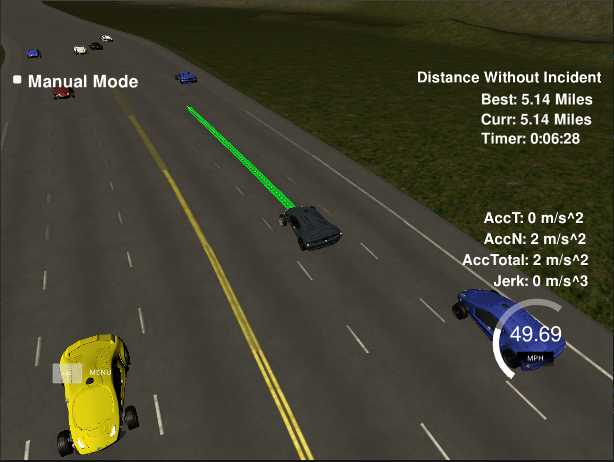

# Highway Driving Path Planner

### Overview
In this project the idea was to create a path planner that can successfully navigate a highway, this is shown in the image below where we are without incident:



**Objectives**
1) The vehicle must not exceed 50mph.
2) The vehicle is optimised to stay in the middle lane unless it is prevalent to overtake.
3) The vehicle must not collide with any objects.
4) The vehicle much not exceed 10m/s^2 Acceleration and 10m/s^3 of Jerk.

### Theory of Operation 
The planner in this implementation is split into three distinct parts:

**Dynamic Object Detection**

In the Dynamic Object Detection module (DoD) we take the raw input produced by the vehicles sensor fusion. We then iterate over
all of the data that is received and perform a series of steps:

1) We look at the Frenet D coordinate of the object to determine if it is in the given lane we are interested in.
2) We then calculate the velocity of that object and then, based on the velocity, we predict how much that object will have 
moved over a given time period.
3) We then add this prediction to the objects current Frenet s coordinate to see where it will be in the future.
4) From here we are now able to determine if this object is going to be behind ego vehicle or in front of it and if it is the closest
vehicle from both the front and the rear of ego.
5) Based on these measurements we output an object of the dynamic object describing where it is, the speed it is doing and what impact this will
have on the ego vehicle.
6) For each lane we then implement a detection to understand the optimal lane.

**Behaviour Planner**

The behaviour planner takes in the data outputted from the DoD module and based upon egos position and velocity, makes decisions
on what actions ego should next take:

1) We calculate a cost for each lane, this is based on the speed of the dynamic objects, the distance to the dynamic objects
both forward and backward and the legality of the maneuver e.g. high penalty for going into oncoming traffic.
2) We then have two main transition states. Adaptive Cruise Control (ACC) modulates the speed of ego vehicle based on the
forward object. Lane Change allows us to transition from the current lane to a new lane.
3) We now calculate a total cost for each lane which is weighted and normalised. The eights of the two outer lanes are higher
that the center lane so ego is bias towards staying central.
4) We then have a finite state machine that makes decisions on what state ego should be in based on the current position
and the costs of all lanes.
5) Finally the ego states are outputted to our trajectory generation.

**Trajectory Generation**

For the trajectory generation we take the output of the behaviour planner to generate a trajectory that is within ego
constraints and matches the speed and lane that has been requested by the planner. To do this we:

1) Take the previous points of the trajectory ego was on as a baseline for where ego needs to be.
2) We predict a small subset of points into the future based on the map waypoints and that which is requested by the planner. 
This is over a predefined maximum length but dependant on how much of the previous trajectory has been used.
3) We then normalise the coordinate system to be based at a 0 heading and (0, 0) start point by ego. 
4) We now use spline fitting to create a smooth trajectory over the sparse points we have previously generated by splitting each spline into segments.
not only does this allow for a smooth path, it also allows us to take smooth acceleration.
5) Finally we convert the coordinates back to cartesian for outputting to the simulator and controller.

#### The map of the highway is in data/highway_map.txt
Each waypoint in the list contains  [x,y,s,dx,dy] values. x and y are the waypoint's map coordinate position, the s value is the distance along the road to get to that waypoint in meters, the dx and dy values define the unit normal vector pointing outward of the highway loop.

The highway's waypoints loop around so the frenet s value, distance along the road, goes from 0 to 6945.554.

#### Main car's localization Data (No Noise)

["x"] The car's x position in map coordinates

["y"] The car's y position in map coordinates

["s"] The car's s position in frenet coordinates

["d"] The car's d position in frenet coordinates

["yaw"] The car's yaw angle in the map

["speed"] The car's speed in MPH

#### Previous path data given to the Planner

//Note: Return the previous list but with processed points removed, can be a nice tool to show how far along
the path has processed since last time. 

["previous_path_x"] The previous list of x points previously given to the simulator

["previous_path_y"] The previous list of y points previously given to the simulator

#### Previous path's end s and d values 

["end_path_s"] The previous list's last point's frenet s value

["end_path_d"] The previous list's last point's frenet d value

#### Sensor Fusion Data, a list of all other car's attributes on the same side of the road. (No Noise)

["sensor_fusion"] A 2d vector of cars and then that car's [car's unique ID, car's x position in map coordinates, car's y position in map coordinates, car's x velocity in m/s, car's y velocity in m/s, car's s position in frenet coordinates, car's d position in frenet coordinates. 

---

## Dependencies

* cmake >= 3.5
  * All OSes: [click here for installation instructions](https://cmake.org/install/)
* make >= 4.1
  * Linux: make is installed by default on most Linux distros
  * Mac: [install Xcode command line tools to get make](https://developer.apple.com/xcode/features/)
  * Windows: [Click here for installation instructions](http://gnuwin32.sourceforge.net/packages/make.htm)
* gcc/g++ >= 5.4
  * Linux: gcc / g++ is installed by default on most Linux distros
  * Mac: same deal as make - [install Xcode command line tools]((https://developer.apple.com/xcode/features/)
  * Windows: recommend using [MinGW](http://www.mingw.org/)
* [uWebSockets](https://github.com/uWebSockets/uWebSockets)
  * Run either `install-mac.sh` or `install-ubuntu.sh`.
  * If you install from source, checkout to commit `e94b6e1`, i.e.
    ```
    git clone https://github.com/uWebSockets/uWebSockets 
    cd uWebSockets
    git checkout e94b6e1
    ```
    
### Simulator
You can download the Term3 Simulator which contains the Path Planning Project from the [releases tab (https://github.com/udacity/self-driving-car-sim/releases/tag/T3_v1.2).  

To run the simulator on Mac/Linux, first make the binary file executable with the following command:
```shell
sudo chmod u+x {simulator_file_name}
```

### Usage

- Change into the top level of the project repo.
- Clean the directory by running:
```$bash
./clean.sh
```
- Build the project with:
```$bash
./build.sh
```
- Run the project with:
```$xslt
./run.sh
```
- Start the simulator.

*NOTE:* Sometimes due to idiosyncrasies with the simulator you may have to restart the simulator and/or the path planner to get the car moving.

